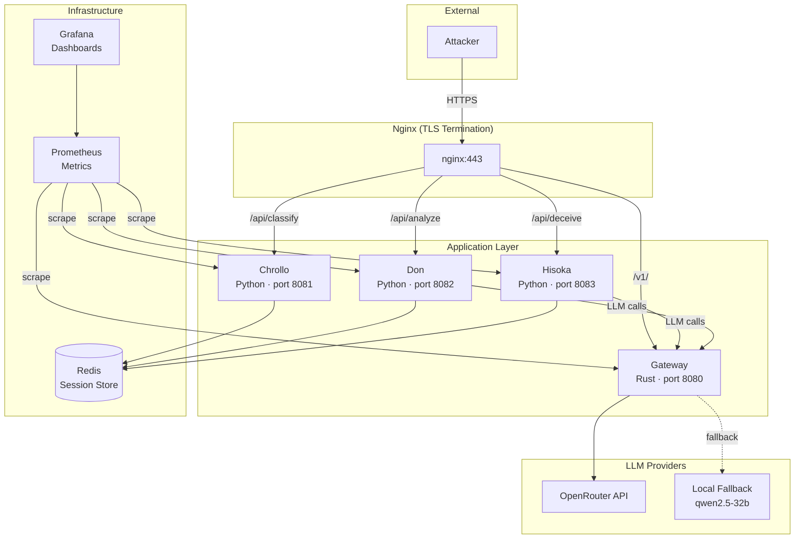
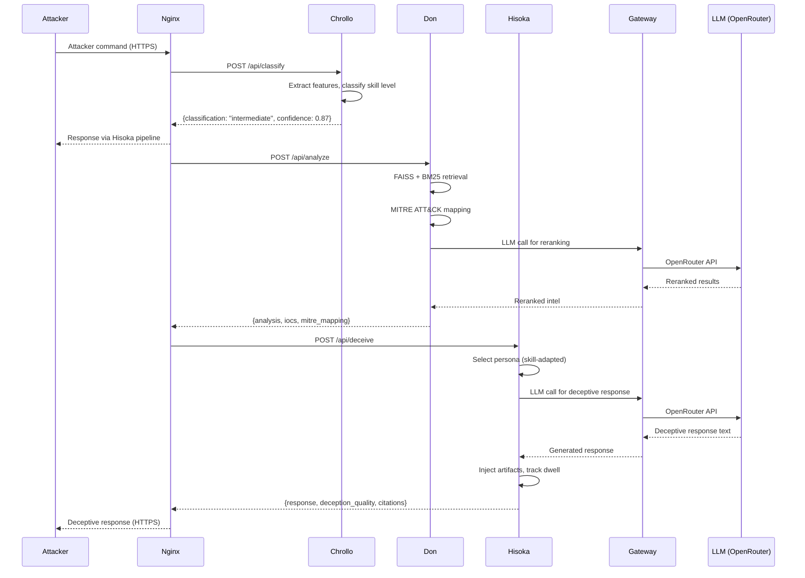
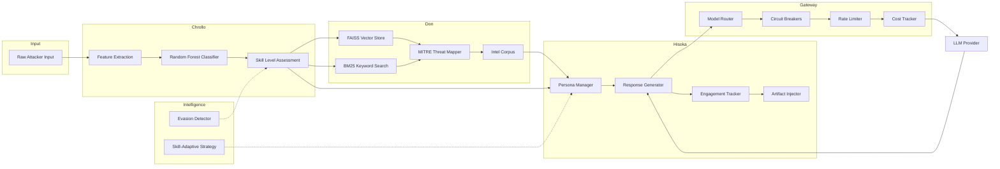

# RAGIN Architecture Documentation

## System Context

### High-Level Architecture



### Component Interaction Diagram



### Data Flow Diagram



---

## Component Details

### Chrollo — Behavioral Classifier

**Location:** `ragin/chrollo/` (6 files)

| File | Purpose |
|------|---------|
| `classifier.py` | Random Forest model, training, inference |
| `features.py` | Feature extraction from attacker behavior |
| `models.py` | Data models (SessionLog, SkillLevel) |
| `pipeline.py` | End-to-end classification pipeline |
| `session_parser.py` | Parse raw session data into structured format |

**How it works:**
1. Receives raw attacker session data (commands, timing, tool signatures)
2. `FeatureExtractor` computes numerical features: command frequency, tool usage patterns, timing analysis, entropy measures
3. `ChrolloClassifier` (Random Forest, scikit-learn) predicts skill level: novice, intermediate, expert, apt
4. Model stored at `models/chrollo/rf_classifier.joblib` (trained offline)

**Key metrics:** `ragin_chrollo_requests_total`, `ragin_chrollo_request_duration_seconds`

### Don — Hybrid RAG Engine

**Location:** `ragin/don/` (7 files)

| File | Purpose |
|------|---------|
| `rag_engine.py` | Main RAG orchestration |
| `vector_store.py` | FAISS vector similarity search |
| `intel_corpus.py` | Threat intelligence document store |
| `threat_mapper.py` | Map findings to MITRE ATT&CK framework |
| `models.py` | Data models (IOC, MITRETactic, ThreatAnalysis) |
| `pipeline.py` | End-to-end analysis pipeline |

**How it works:**
1. Receives classified attacker input from Chrollo
2. Performs hybrid retrieval: FAISS vector similarity + BM25 keyword matching
3. Maps identified threats to MITRE ATT&CK tactics and techniques
4. Optionally calls LLM via Gateway for reranking and synthesis
5. Returns structured threat analysis with citations and confidence scores

**Key metrics:** `ragin_don_requests_total`, `ragin_don_request_duration_seconds`

### Hisoka — Adaptive Deception Engine

**Location:** `ragin/hisoka/` (9 files)

| File | Purpose |
|------|---------|
| `deceiver.py` | Top-level orchestrator |
| `deception.py` | Core deception logic (PersonaManager, ResponseGenerator, EngagementTracker, ArtifactInjector) |
| `persona.py` | Persona definitions and selection |
| `response_generator.py` | LLM-powered response generation |
| `session_manager.py` | Session state management with TTL |
| `dwell_tracker.py` | Track attacker dwell time in honeypot |
| `models.py` | Data models (Persona, SessionState, DeceptionResponse) |
| `pipeline.py` | End-to-end deception pipeline |

**How it works:**
1. Receives threat analysis from Don and attacker skill level from Chrollo
2. `PersonaManager` selects appropriate persona (novice-friendly, expert-level, APT-grade)
3. `ResponseGenerator` calls LLM via Gateway with skill-adapted system prompts
4. `ArtifactInjector` plants realistic but misleading artifacts
5. `EngagementTracker` monitors attacker dwell time and adjusts strategy
6. `SessionManager` maintains per-attacker session state in Redis with TTL

**Key metrics:** `ragin_hisoka_requests_total`, `ragin_hisoka_request_duration_seconds`

### Intelligence Module

**Location:** `ragin/intelligence/` (5 files)

| File | Purpose |
|------|---------|
| `evasion_detector.py` | Detect when attackers probe for honeypot markers |
| `adaptive_response.py` | Adjust strategies based on evasion signals |
| `skill_strategy.py` | Skill-level-adaptive strategy selection |
| `models.py` | Data models (EvasionIndicator, AdjustmentRecommendation) |

**How it works:**
- `EvasionDetector` scans attacker input for tool signatures (nmap, metasploit, etc.), timing analysis, and behavioral patterns indicating honeypot detection attempts
- Feeds evasion signals back to Hisoka for persona adjustment

### LLM Gateway (Rust)

**Location:** `llm-gateway/src/` (10 files)

| File | Purpose |
|------|---------|
| `main.rs` | Axum HTTP server, route handlers |
| `gateway.rs` | Core gateway logic |
| `clients.rs` | OpenRouter API client |
| `config.rs` | Configuration loading |
| `models.rs` | Request/response models |
| `metrics.rs` | Prometheus metrics |
| `validation.rs` | Input validation |
| `prompt_engine.rs` | Prompt template management |
| `error.rs` | Error types |
| `lib.rs` | Library exports |

**How it works:**
1. Receives LLM requests from Python components via HTTP
2. Routes to appropriate model based on task type and cost constraints
3. Circuit breaker pattern: trips after 5 failures, recovers after 60s
4. Rate limiting: 60 RPM, 100K TPM
5. Cost tracking: per-request and per-component budgets
6. Fallback chain: tries primary model, then fallbacks in order

**Key metrics:** `ragin_gateway_requests_total`, `ragin_circuit_breaker_state`, `ragin_cost_total_usd`

---

## Data Models

### Core Entities

```
SessionLog ──→ SkillLevel (novice|intermediate|expert|apt)
     │
     ▼
ThreatAnalysis ──→ IOC ──→ MITRETactic
     │
     ▼
Persona ──→ DeceptionResponse ──→ Artifact
     │
     ▼
EvasionResult ──→ AdjustmentRecommendation
```

### Inter-Component API Contracts

| Endpoint | Method | Request | Response |
|----------|--------|---------|----------|
| `/api/classify` | POST | `{session_log: SessionLog}` | `{classification: SkillLevel, confidence: float, features_used: list}` |
| `/api/analyze` | POST | `{query: string, skill_level: SkillLevel}` | `{answer: string, citations: list, mitre_mapping: list, confidence: float}` |
| `/api/deceive` | POST | `{analysis: ThreatAnalysis, session_state: SessionState}` | `{response: string, skill_assessment: SkillLevel, deception_quality: float, citations: list}` |
| `/v1/chat/completions` | POST | `{model: string, messages: list, max_tokens: int}` | `{choices: [{message: {content: string}}], usage: {prompt_tokens, completion_tokens}}` |
| `/health` | GET | — | `{status: "healthy", component: string, timestamp: float}` |
| `/metrics` | GET | — | Prometheus exposition format |

---

## Deployment Architecture

### Docker Compose Topology

**Compose files:**

| File | Purpose | Command |
|------|---------|---------|
| `docker-compose.yml` | Base configuration (all services) | `docker compose up` |
| `docker-compose.prod.yml` | Production overrides (resource limits, security) | `docker compose -f docker-compose.yml -f docker-compose.prod.yml up -d` |
| `docker-compose.test.yml` | Test overrides (debug logging, no persistent volumes) | `docker compose -f docker-compose.yml -f docker-compose.test.yml up` |
| `docker-compose.canary.yml` | Canary deployment for A/B testing | `docker compose -f docker-compose.yml -f docker-compose.canary.yml up -d` |

### Network Segmentation

```
Internet ──→ :443 ──→ [ragin-external] ──→ Nginx
                                           │
                                     [ragin-internal]
                                           │
                        ┌──────────────────┼──────────────────┐
                        │                  │                  │
                    Gateway            Chrollo/Don/Hisoka    Redis
                    (port 8080)        (ports 8081-8083)    (6379)
```

### Storage Strategy

| Service | Storage | Persistence | Backup |
|---------|---------|-------------|--------|
| Redis | `/data` volume | AOF append-only | `BGREWRITEAOF` + volume copy |
| Prometheus | `/prometheus` volume | TSDB | Volume copy |
| Grafana | `/var/lib/grafana` volume | Dashboard JSON | Volume copy |
| Cost DB | `data/costs.db` | SQLite file | File copy |
| FAISS index | `models/don/` | On-disk index | File copy |
| Chrollo model | `models/chrollo/` | joblib files | File copy |

### Resource Limits (Production)

| Service | CPU Limit | CPU Reserve | Memory Limit | Memory Reserve |
|---------|-----------|-------------|--------------|----------------|
| Gateway | 2.0 | 0.5 | 2 GB | 512 MB |
| Chrollo | 1.0 | 0.25 | 1 GB | 256 MB |
| Don | 2.0 | 0.5 | 2 GB | 512 MB |
| Hisoka | 2.0 | 0.5 | 2 GB | 512 MB |
| Redis | 0.5 | 0.1 | 512 MB | 128 MB |
| Prometheus | 1.0 | 0.25 | 1 GB | 256 MB |
| Grafana | 0.5 | 0.1 | 512 MB | 128 MB |
| Nginx | 0.5 | 0.1 | 256 MB | 64 MB |
| **Total** | **9.5** | **2.2** | **9.5 GB** | **2.1 GB** |
